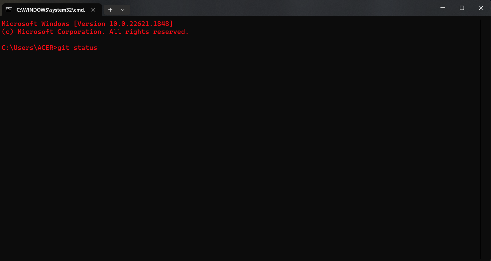

# Git and GitHub Training (Workshop) at Gandaki University


Author: **<u>Nirajan Dhakal</u>**

&nbsp; &nbsp; &nbsp; &nbsp;&nbsp; &nbsp;

Credit: FreeCodeCamp  &nbsp; &nbsp; &nbsp; &nbsp; &nbsp; &nbsp; &nbsp; &nbsp; &nbsp; &nbsp; &nbsp; &nbsp; &nbsp; &nbsp; Credit: Elegant Themes

&nbsp;
&nbsp;
&nbsp;
&nbsp;
&nbsp;
&nbsp;
&nbsp;
&nbsp;
&nbsp;

<br>

<strong>It is advised that you read all the text here once thoroughly and then return to the top to follow the instructions on what and how to do things for this workshop.</strong>


Here you will learn:
1. How to install Git on your computer
2. How to use Git on your computer
3. How to create a GitHub account
4. How to use GitHub on your computer
5. How to create a repository on GitHub
6. How to use Git commands on your computer
7. How to use Terminal or Powershell on your computer

<br>

Download the following programs:
- **Git**
- **GitHub Desktop Application**
- **Visual Studio Code**
- (Optional: Download only if you need it) **GCC Compiler**
- **Sublime Text**
- **Java Development Kit**

<strong> The path to download each program is provided below.</strong>

1. Git: https://git-scm.com/downloads
2. GitHub Desktop Application: https://desktop.github.com/
3. Visual Studio Code: https://code.visualstudio.com/
4. GCC Compiler: https://sourceforge.net/projects/mingw/files
5. Sublime Text:  https://www.sublimetext.com/
6. Java Development Kit (JDK): https://www.oracle.com/java/technologies/downloads/


<br>

Note that you download all the necessary applications first and then go through installation phase only for the programs mentioned here.

After you download the applications, please install *VS Code** and **GitHub Desktop Application** but do not perform anything as  of now.

<br>

For **Git**, you have to set `Environment Variables` in `PATH` directory, which can be overwhelming. **VS Code** takes long time to install in the device, and to continue with smoothy work, please install it after the file is downloaded.

As of writing, **Git** version is 2.40.0. For your simplicity, there is a monitor icon at the right side on the website. You can download from that button. In Linux based OS, Git used to be pre-installed in the OS but this is not the case these days, so Linux users too can download Git from the command below:

For debian based Linux Distro, enter the following command on your terminal: ```sudo apt-get install git```


For MacOS, you can download Git from: https://git-scm.com/download/mac

<br>

If you have any problem regarding `Git`, please visit [this url](https://stackoverflow.com/questions/315911/git-for-beginners-the-definitive-practical-guide). This is redirect link to StackOverflow which provides beginner's practical guide to Git and can be a great resource to learn Git.

If you have any problem in downloading Git, go to a pdf file [here](./Git%20PDF%20Files/what%20is%20git.pdf) and read the document, you will find the solution. The PDF is large, and GitHub won't show the file in the Rendered Block. Download the file and look into it.

To Follow the Git Manual, go to the [Manual](./Git%20PDF%20Files/Progit-Git%20Manual.pdf) and follow along.

- To *Download* **Mingw** (**GCC Compiler**), To *Set Up* **VS Code** for **GCC Compiler**, please follow the instructions from the videos in the link below:


  - To *Download* **Mingw**, follow [this link](https://youtu.be/0HD0pqVtsmw)


-------------   **Mingw** and **GCC Compiler** are necessary to compile and run C/ C++ programs. If you are not contributing related to C or C++ programming languages, it is not necessary to install them.    -------------------

  
<b> ULTIMATE VS CODE AND GCC COMPILER ALONG WITH C PROGRAMMING REFERENCE </b>
   
   [Click Here](https://youtu.be/irqbmMNs2Bo) for the Ultimate Resource.

<br>

### Before We Dive In Into Git and Github, We Will Learn Simple *Terminal* Commands To Ease Up Our Workflow:

If you are **Windows 11** user, you will find **Terminal** when you `Right-Click` on your screen. In Windows 10 and lower versions, you will find **Command Prompt**. To open Command Prompt, hold `Windows` key and press `R` (`Windows + R`) key at the same time. A dialogue box appears. Type `cmd` and press `Enter` key. A black screen appears which is Terminal / Command Prompt.

The Terminal will look something like this:


<br>

1. Changing Directory (Accessing Directory): ```cd```

   For example: To access Desktop, type ```cd desktop```. Note that there should be a whitespace (space) between `cd` and `desktop`. If `desktop` doesn't work, type `Desktop`.
   
   Again, to access a Directory (Folder) inside Desktop (If your computer has), type ```cd folderName``` where `foldername` is the name of the folder/ directory you want to access to.

2. Changing Drive Root: ```driveName:```
   
   ```driveName``` is the name of drive that you are currently on. Typically, you are in ```C:``` drive when you first open *Terminal*. To change the drive root, type the `name of drive` (capital letter) followed by `:` (colon).
   
   For example, I am currently in ```C:``` drive. If I want to go to ```N:``` drive, I will type ```N:``` and press `Enter` key.

3. Reaching Parent Directory: ```cd..```
  ```cd``` followed by two periods (fullstops).

1. Reaching Root Directory: ```cd\```
   `cd` followed by a backward slash.
   
2. Reaching to a folder from folder path:  ```cd\folderName\subFolderName```

   Reaching to a folder with less effort: ```cd initialLettersOfFolderName Tab Key```. Here, type `cd` and `space`, then type two or three letters of the folder and press ``Tab`` key.
   

6. Creating a Directory/ Folder: ``` mkdir directoryName ``` or ``` md directoryName ```
   
   For example, if you want to create a directory or a folder with name `Test Folder`, type `mkdir Test Folder`. You can use `mkdir` or `md` to create a directory.
   
7. To Know About the System Information: `systeminfo`

8. To Know In Which Volume Are We Working: `vol`

9. To Know the Version of Operating System (OS): `ver`

10. To Know Folder Content of a Certain Directory: `dir`

11. To **Rename** a file/ Folder: `ren oldFileName.fileType newFileName.fileType` or `rename oldFileName.fileType newFileName.fileType`

11. To **Delete** File: `erase fileName.fileType` or `del fileName.fileType`

12. To **Delete** Directory / Folder: `rmdir directoryName`

13. To check ping: `ping siteName`
   

---

Go to [Git.md](https://github.com/dhakalnirajan/git-workshop/blob/main/Git.md) to learn about Git, GitHub, and many more!

---

If you have been follwing the Git.md file, when you commit to a repository on GitHub, you will encounter with a error that needs you to have agreed to Contributor's License Agreement (**CLA**). To do that, go to [https://cla.developers.google.com/about/google-individual](https://cla.developers.google.com/about/google-individual) and read the terms of the agreement, and provide your GitHub username and the mailing address that was used to sign in into GitHub so as to maintain commits to the Open Source Community.